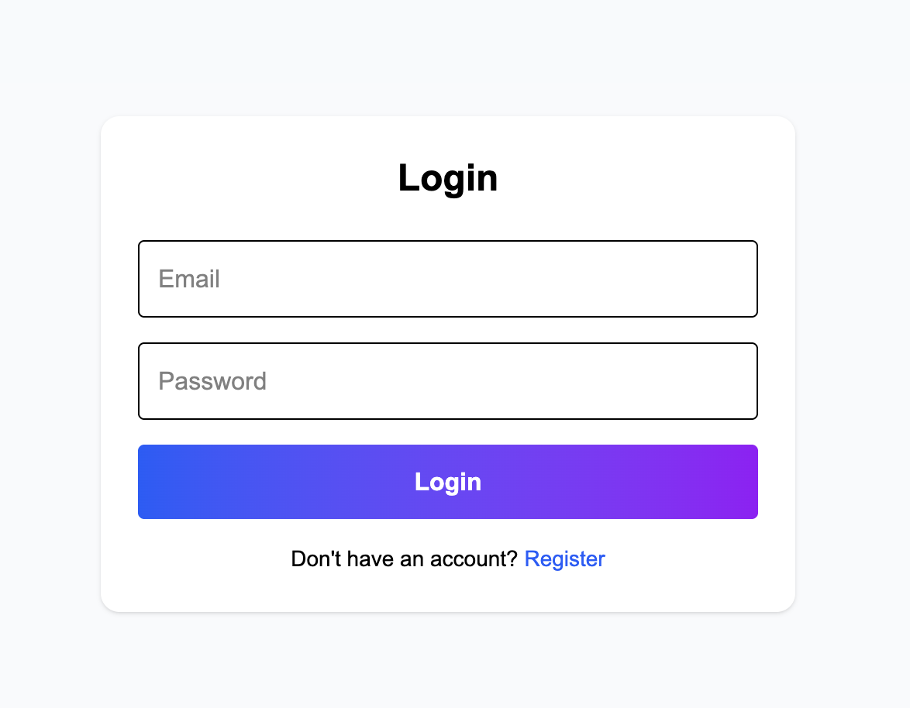
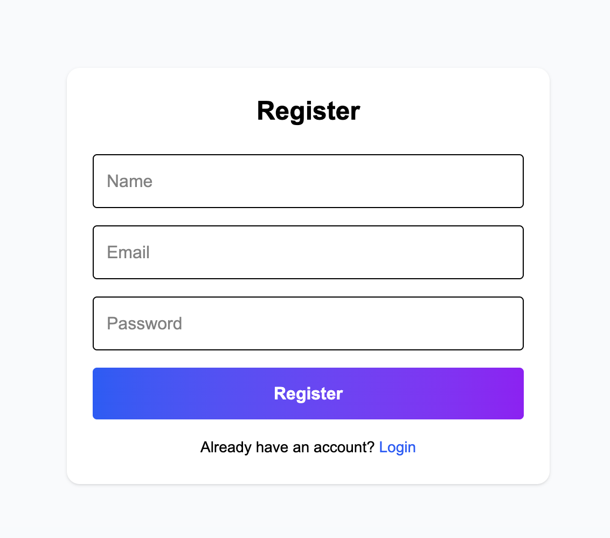

# Task Management App

A full-stack Task Management Application built using the MERN stack with JWT authentication using HTTP-only cookies.

## Features

- User Registration & Login
- JWT Authentication
- HTTP-Only Cookie Authentication
- Protected Routes
- Create Tasks
- Edit Tasks
- Delete Tasks
- Mark Tasks as Completed
- Filter Tasks by Status
- Responsive UI
- Toast Notifications
- Confirmation Dialog for Delete

---

## Tech Stack

### Frontend
- React
- TypeScript
- Tailwind CSS
- Axios
- React Router DOM
- React Hot Toast

### Backend
- Node.js
- Express.js
- MongoDB
- Mongoose
- JWT Authentication
- Cookie Parser

---

## Folder Structure

```bash
backend/
frontend/
```

---

## Environment Variables

### Backend `.env`

```env
PORT=5050
MONGO_URI=your_mongodb_connection_string
JWT_SECRET=your_secret_key
```

---

## Installation

### Clone the repository

```bash
git clone <your-repository-url>
```

### Backend Setup

```bash
cd backend
npm install
npm run dev
```

### Frontend Setup

```bash
cd frontend
npm install
npm run dev
```

---

## API Endpoints

### Auth Routes

| Method | Endpoint | Description |
|---|---|---|
| POST | `/api/auth/register` | Register user |
| POST | `/api/auth/login` | Login user |
| POST | `/api/auth/logout` | Logout user |

### Task Routes

| Method | Endpoint | Description |
|---|---|---|
| GET | `/api/tasks` | Get all tasks |
| GET | `/api/tasks/:id` | Get single task |
| POST | `/api/tasks` | Create task |
| PUT | `/api/tasks/:id` | Update task |
| DELETE | `/api/tasks/:id` | Delete task |

---

## Authentication Flow

- JWT token is generated on login
- Token is stored in HTTP-only cookies
- Protected APIs verify JWT from cookies
- Logout clears authentication cookie


---

---

## Screenshots

### Login Page



---

### Register Page



---

### Edit Task


---

### Mark Completed


---

### Pending Filter


---

### Completed Filter


---

### Delete Task


---


## Author

Rekha N